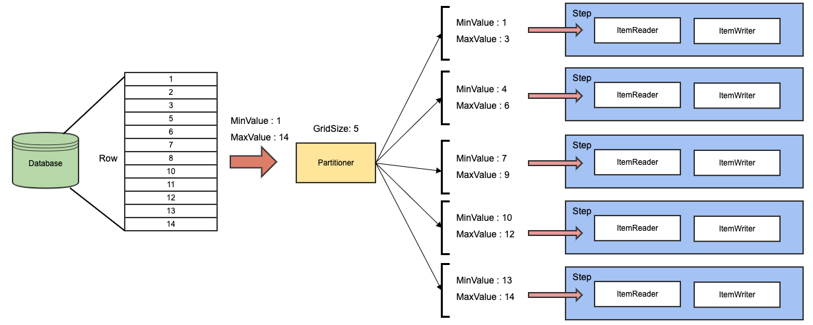
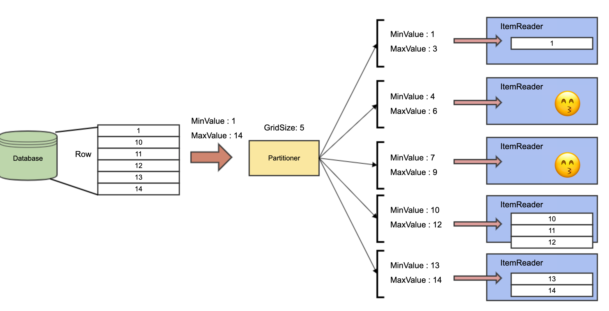

# Spring batch 병렬처리 (with Partitioning step)

주기적으로 많은 데이터를 일괄적으로 처리해야할때 스프링 배치를 사용한다. 처음은 단순한 싱글 스레드로 시작하다가 데이터가 많아질 수록 처리시간을 줄이기 위해 멀티쓰레드를 사용하게 된다.

나의 경우는 DB에서 데이터를 읽어 검색엔진으로 색인하는 일이 많았다. 검색엔진의 최대한 실시간을 보장하기 위해 주기를 짧게 배치를 실행하게 되고 처리속도도 중요해졌다.

이때 사용했던 약간의 팁을 정리해본다.

## Reader를 통한 DB조회

먼저 DB를 조회할때 Springbatch에서 제공하고 있는 Reader를 사용해서 비교적 쉽게 작성할 수 있다. 보통  `AbstractPagingItemReader`, `AbstractCursorItemReader`를 구현한 Reader들을 사용하게 되는것 같다.  JdbcPagingItemReader로 테스트를 해볼텐데 JdbcCursorItemReader는 Thread Safe하지 않으니 잠시 옆으로 치워 두겠다. 꼭 JdbcCursorItemReader로 병렬처리를 해야한다면 여기 참고 할 만한 [좋은 블로그](https://jojoldu.tistory.com/493) 가 있다.

## **Thread Safe한 PagingItemReader 병렬처리의 한계**

Spring batch에서 멀티스레드를 사용하기 위한 가장 간단한 방법은 step에 TaskExecutor를 추가하는 것이다.

```java
@Bean
    public Step multiThreadJdbcPagingReaderStep() {
        return stepBuilderFactory.get("multiThreadJdbcPagingReaderStep")
                                 .<Product, Product>chunk(CHUNK_SIZE)
                                 .reader(multiJdbcPagingReader())
                                 .writer(new PrintWriter())
                                 .taskExecutor(taskExecutor())
                                 .throttleLimit(10)
                                 .build();
    }

    private TaskExecutor taskExecutor() {
        ThreadPoolTaskExecutor executor = new ThreadPoolTaskExecutor();
        executor.setCorePoolSize(10);
        executor.setMaxPoolSize(10);
        executor.setQueueCapacity(100);
        executor.setThreadNamePrefix("async-");
        executor.initialize();
        return executor;
    }
```

기존에 사용하던 step 구조에 `taskExecutor()`만 추가해주면 된다.

싱글쓰레드와 멀티쓰레드의 처리시간을 비교해 보면 다음과 같다.

| type | time |
| --- | --- |
| 싱글쓰레드 JdbcPagingItemReader | 850ms |
| 멀티쓰레드 JdbcPagingItemReader | 772ms |

멀티쓰레드가 더 빠른것을 볼 수 있었다. 그런데 그닥 차이가 나는것 같지 않다. 별다른 처리를 하는게 없는 너무 단순한 예제의 Reader, Writer 구조라 그런것 같다.

Reader가 조금 더 복잡하고 많은 처리를 한다는 걸 가정해서 한번 읽어 올때 1초가 걸린다고 보고 sleep을 1초 걸어두고 다시 비교해 보자

| type | time |
| --- | --- |
| 싱글쓰레드 JdbcPagingItemReader | 11 sec 716ms |
| 멀티쓰레드 JdbcPagingItemReader | 11 sec 655ms |

이번에도 약간 빠르긴하지만 별차이가 나지 않았다.

Writer에도 복잡한 처리가 있다고 가정하고 처리되는 chunk마다 1초가 걸린다면 어떨까? (sleep 1초)

| type | time |
| --- | --- |
| 싱글쓰레드 JdbcPagingItemReader | 21 sec 461ms |
| 멀티쓰레드 JdbcPagingItemReader | 12 sec 512ms |

이번에는 멀티쓰레드에서 훨씬 빠르게 처리되는걸 확인할 수 있었다. 그러면 Reader쪽에서 쓰레드 처리를 못해주고 있는게 아닐까라고 생각해 볼 수 있다.

이유는 `JdbcPagingItemReader`가 상속받고 있는 `AbstractPagingItemReader` 에 있다.

```java
public class JdbcPagingItemReader<T> extends AbstractPagingItemReader<T>
```

`AbstractPagingItemReader`의 소스를 살펴보면 **Thread Safe** 하기 위해 `synchronized`로 처리하고 있기 때문이다.

```java
@Nullable
@Override
protected T doRead() throws Exception {

	synchronized (lock) {

		if (results == null || current >= pageSize) {

		//.... 이하 코드 생략
```

결국엔 멀티쓰레드로 동작해서 읽더라고 하나씩 접근해 처리하므로 병렬처리의 이점을 살릴 수 없었다.

## Partitioning step

두번째 방법은 Spring batch에서 제공하는 Partitioner을 활용한 방법이다.

미리 각각의 Step들이 처리해야할 범위를 나눠서 정해주고 Reader자원을 공유하지 않는다. partitioner에서 범위를 Minvalue, MaxValue로 나눠서 Reader에 전달하고 Reader는 정해진 범위만 처리하면 된다.



<aside>
💡 GridSize는 몇개의 StepExecution을 생성할지를 결정하는 값이다.

</aside>

Reader는 자원을 공유하지 않기 때문에 `synchronized`에 영향을 받지 않고 처리할 수 있다. 처리시간을 비교해 보면 다음과 같다.

| type | time |
| --- | --- |
| 싱글쓰레드 JdbcPagingItemReader | 11 sec 716ms |
| 멀티쓰레드 JdbcPagingItemReader | 11 sec 655ms |
| Partitioning JdbcPagingItemReader | 2 sec 792ms |

드디어 생각했던 병렬처리의 결과가 나온것 같다.

### 생각해볼 점

Partitioner를 어떻게 잘 나눠줄 수 있을까를 상황에 맞게 고민해 봐야 할 것 이다.
예시에서는 Database에서 id라는 순차적인 값으로 보고 제일 마지막 값을 가지고 와서 GridSize에 맞게 MinValue와 MaxValue로 값을 전달해주었다.
그런데 만약 id가 중간중간 값이 비어 있다면 어떨까?



데이터가 고르게 분포되지 않았다. 2번째 3번째 Step은 처리할 데이터가 없어서 놀고 있다. 데이터의 양이 많다면 심한 불균형을 가지고 올 수 있다.